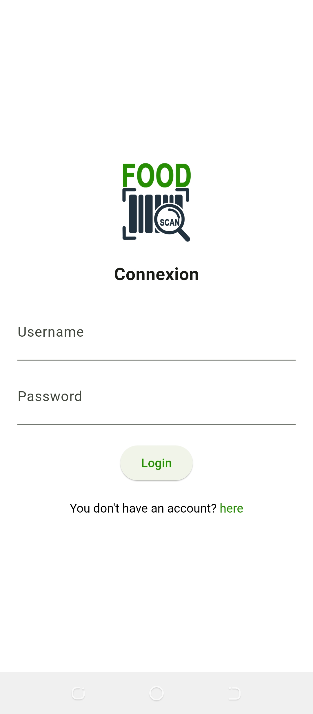
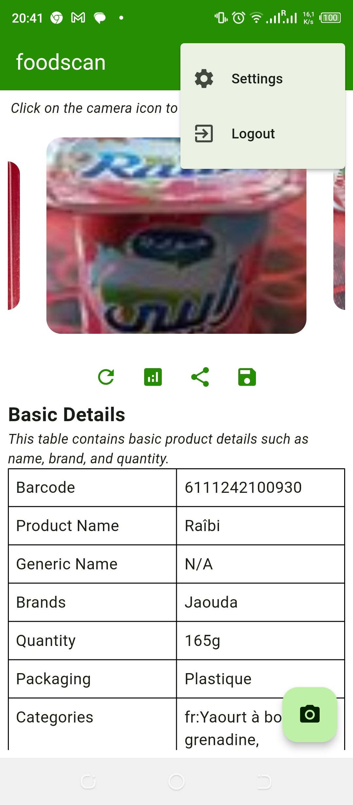

# Food Scan

## Partie 1: Expression du besoin

### 1.1. Contexte et définition du projet

Dans un contexte où la prise de conscience autour de l'importance de la santé ne cesse de croître, la nécessité pour les consommateurs d'accéder facilement à des informations fiables et compréhensibles sur les produits qu'ils consomment est devenue primordiale. Ce projet vise à répondre à cette exigence en développant une solution numérique permettant de scanner les étiquettes des produits alimentaires, offrant ainsi une analyse instantanée de leur composition grâce à une intelligence artificielle. Ce projet a pour ambition de rendre l'information sur les produits transparente et accessible à tous, contribuant ainsi à améliorer la qualité de vie.

### 1.2. Objectif du projet

L'objectif principal de ce projet est de développer une application mobile qui facilite l'accès à des informations détaillées et fiables sur la composition des produits alimentaires, en vue d'améliorer la prise de décision des consommateurs concernant leur santé. Pour atteindre cet objectif global, le projet se concentre sur trois objectifs spécifiques :

- **Concevoir une interface utilisateur accessible et intuitive** :
  

  L'objectif est de permettre une expérience utilisateur fluide et agréable, réduisant ainsi la courbe d'apprentissage et augmentant l'engagement des utilisateurs.
  

- **Intégrer une fonction de recherche de produits** :
  

  Développer une fonctionnalité permettant aux utilisateurs d’accéder instantanément à des informations détaillées sur un produit donné via un scan du code-barres.
  

- **Fournir une analyse des ingrédients** :
  

  Offrir aux utilisateurs des informations claires et précises sur les ingrédients. L'objectif est d'aider les consommateurs à comprendre l'impact de leurs choix alimentaires sur leur santé et à prendre des décisions éclairées concernant leur alimentation.
  

### 1.3. Périmètre du projet

Le périmètre de ce projet englobe le développement d'une application mobile dédiée à la promotion d'une alimentation saine et informée pour les consommateurs.

### 1.4. Identité visuelle

  

<em>Image 1: Logo</em>

## Partie 2: Analyse et conception

### 2.1 Description fonctionnelle des besoins

La description fonctionnelle des besoins pour le développement de cette application mobile se détaille comme suit :

#### Fonctionnalités Principales

- **Interface Utilisateur Accessible et Intuitive**
  - **Besoin** : Création d'une interface utilisateur (UI) qui soit simple à naviguer. L'UI doit être conçue pour être esthétiquement plaisante et fonctionnelle sur divers appareils mobiles.
  - **Fonctionnalités UI** : Menus clairs, boutons larges, textes lisibles, navigation simplifiée, et adaptation à la taille de l'écran.

- **Recherche de Produit**
  - **Besoin** : Offrir une fonction de recherche permettant aux utilisateurs de trouver des produits par le code-barres.
  - **Fonctionnalités de Recherche** : Recherche de produit par code-barres.

- **Analyse des Ingrédients**
  - **Besoin** : Fournir des informations détaillées et fiables sur la composition des produits alimentaires, y compris les valeurs nutritionnelles, les ingrédients, et les allergènes grâce à une intelligence artificielle.
  - **Fonctionnalités d'Information** : Analyse de la composition du produit grâce à une intelligence artificielle.

#### Fonctionnalités Secondaires

- **Partage du Produit via les Réseaux Sociaux**
  - **Besoin** : Permettre aux utilisateurs de partager le produit avec leurs proches.
  - **Fonctionnalités de Partage** : Partage du produit via les réseaux sociaux.

- **Archivage du Produit**
  - **Besoin** : Permettre aux utilisateurs d'archiver le produit pour une utilisation hors ligne.
  - **Fonctionnalités d'Archivage** : Archivage du produit dans une base de données locale.

- **Création de Profil Utilisateur**
  - **Besoin** : Permettre aux utilisateurs de créer des profils.
  - **Fonctionnalités de Profil** : Enregistrement, connexion, gestion du compte.

### 2.2. Spécifications techniques

Pour garantir la réussite de ce projet, nous avons défini les spécifications techniques suivantes, qui orienteront le développement de l'application mobile. Ces spécifications ont été soigneusement choisies pour assurer la flexibilité, la performance et une excellente expérience utilisateur sur les différentes plateformes.

#### Architecture et Design Pattern

- **Architecture** : 
  

  L'application sera conçue avec une architecture modulaire, ce qui signifie que les différentes fonctionnalités de l'application seront développées et gérées comme des modules indépendants. Cela permet une meilleure gestion du code, facilite la maintenance et permet des mises à jour et des ajouts de fonctionnalités sans affecter l'ensemble de l'application.
  

- **Design Pattern** : 
  

  Le projet suivra le design pattern Clean Architecture, qui sépare l'application en couches distinctes, chacune ayant ses propres responsabilités. Cela inclut les couches de présentation, de domaine, de données et d'infrastructure. Ce design pattern permet de rendre le code plus maintenable, testable et flexible.
  

#### Backend

- **Open Food Facts API** : 
  

  Utilisée pour la recherche de produits et l'authentification des utilisateurs. Open Food Facts fournit une base de données libre et collaborative sur les produits alimentaires, ce qui permet d'obtenir des informations détaillées et fiables sur une vaste gamme de produits.
  

  
- **Gemini API** : 
  

  Utilisée pour l'analyse des résultats des produits. Gemini API fournira des fonctionnalités avancées d'analyse et de traitement des données, permettant de fournir des informations précises et pertinentes aux utilisateurs concernant la composition des produits alimentaires.
  

#### Front-end

- **Flutter** : 
  

  Le développement front-end sera réalisé avec Flutter, un framework avancé permettant la création d'applications cross-platform pour iOS et Android. Flutter est choisi pour sa capacité à offrir une expérience utilisateur cohérente et performante sur les deux plateformes, grâce à son système de widgets personnalisables et son moteur de rendu performant. Cela permettra de garantir une interface utilisateur fluide, réactive et visuellement attrayante, tout en accélérant le cycle de développement grâce à la possibilité de réutiliser le code pour les deux plateformes.
  

### 2.3. Diagramme de cas d'utilisation

L'acteur principal est l'utilisateur. Il peut créer un compte et se connecter. Ensuite, il peut scanner un produit puis, s'il le souhaite, analyser le produit ou le partager avec ses proches. Il peut également archiver le produit et le gérer hors ligne. Il peut aussi envoyer la localisation d'où il a scanné le produit. L'acteur secondaire est l'API d'Open Food Facts pour l'authentification et la recherche de produits, ainsi que l'API de Gemini pour l'analyse des produits.

  

<em>Image 2: Diagramme de cas d'utilisation</em>

### 2.4. Diagramme de classe

On a deux classes principales : une classe utilisateur et une classe produit. La classe utilisateur étend la classe utilisateur de l'API Open Food Facts et la classe produit étend la classe produit de l'API Open Food Facts.

  

<em>Image 3: Diagramme de classe</em>

### 2.5. Prototype

#### Onboarding

Le point d'entrée est le splash screen, puis le processus d'onboarding en passant par l'acceptation du contrat de licence, la phase d'inscription et de connexion, puis enfin, après connexion, on arrive sur la page d'accueil.

  
  ➔
  
  ➔
  
  ➔
  
  ➔
  
  ➔
  
  ➔
  
  ➔
  
  ➔
  

#### Scan et recherche

La recherche d'un produit se fait par le scan du code-barres du produit, puis on obtient les photos du produit, les informations basiques du produit, les informations nutritionnelles, les informations sur les additifs et les allergènes, et enfin les informations additionnelles.

  
  ➔
  
  ➔
  
  ➔
  
  ➔
  

#### Analyse du produit

Il s'agit d'analyser le produit à l'aide de l'intelligence artificielle de Google nommée Gemini.

  
  ➔
  
  ➔
  

#### Partage du produit

Il s'agit de partager le produit sur les réseaux sociaux de son choix.

  
  ➔
  
  ➔
  

#### Historique des produits sauvegardés

Cet écran présente l'historique des produits sauvegardés.

  
  ➔
  
  ➔
  

#### Partage de la localisation d'où le produit a été scanné

Ces écrans permettent de gérer les produits sauvegardés, en les supprimant, en les partageant ou en envoyant la localisation d'où le produit a été scanné.

  
  ➔
  
  ➔
  

#### Les produits hors connexion

Cet écran permet de visualiser les produits lorsqu'on n'a pas de connexion internet à travers un mécanisme de cache pour les images et une base de données locale pour stocker les informations sur le produit.

  
  ➔
  

